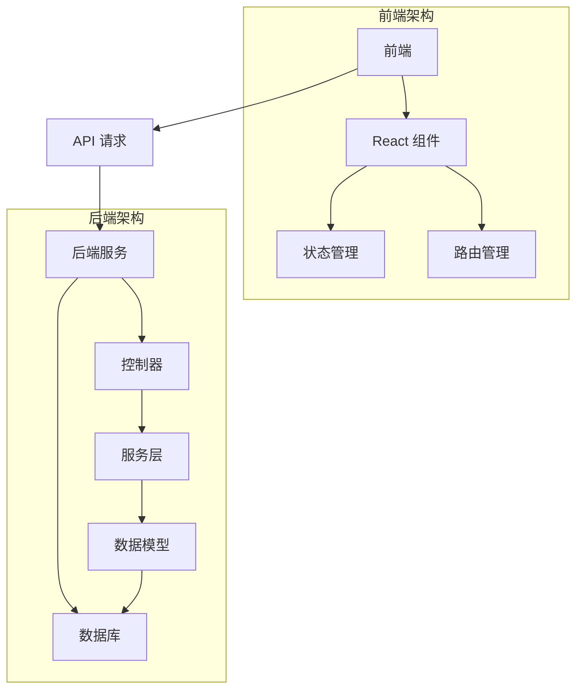

# RBAC 权限管理系统

## 项目简介

RBAC（Role-Based Access Control）权限管理系统是一个基于角色的访问控制系统，提供完整的权限管理解决方案。系统采用前后端分离架构，使用现代化的技术栈，实现了用户管理、角色管理、权限管理等核心功能。

## 技术栈

### 前端
- React 18
- TypeScript
- Ant Design 5.x
- Vite
- Less
- Axios
- React Router 6

### 后端
- Node.js
- Express
- TypeScript
- MySQL
- JWT
- Sequelize

## 项目结构

```
.
├── client/                 # 前端项目
│   ├── src/
│   │   ├── assets/        # 静态资源
│   │   ├── components/    # 公共组件
│   │   ├── layouts/       # 布局组件
│   │   ├── pages/         # 页面组件
│   │   ├── router/        # 路由配置
│   │   ├── services/      # API 服务
│   │   ├── types/         # 类型定义
│   │   ├── utils/         # 工具函数
│   │   ├── App.tsx        # 根组件
│   │   └── main.tsx       # 入口文件
│   └── package.json       # 前端依赖
│
├── server/                 # 后端项目
│   ├── src/
│   │   ├── config/        # 配置文件
│   │   ├── controllers/   # 控制器
│   │   ├── middleware/    # 中间件
│   │   ├── models/        # 数据模型
│   │   ├── routes/        # 路由
│   │   ├── services/      # 业务服务
│   │   ├── utils/         # 工具函数
│   │   └── app.ts         # 应用入口
│   └── package.json       # 后端依赖
│
└── README.md              # 项目说明文档
```

## 系统架构



## 功能模块

1. 用户管理
   - 用户列表
   - 用户创建
   - 用户编辑
   - 用户删除
   - 用户搜索

2. 角色管理
   - 角色列表
   - 角色创建
   - 角色编辑
   - 角色删除
   - 角色搜索

3. 权限管理
   - 权限列表
   - 权限创建
   - 权限编辑
   - 权限删除
   - 权限搜索

4. 系统功能
   - 用户登录
   - 权限验证
   - 路由守卫
   - 数据统计

## 快速开始

### 环境要求

- Node.js >= 16
- MySQL >= 8.0
- npm >= 8

### 安装依赖

```bash
# 安装前端依赖
cd client
npm install

# 安装后端依赖
cd ../server
npm install
```

### 配置数据库

1. 创建 MySQL 数据库
2. 修改 `server/src/config/database.ts` 中的数据库配置

### 启动项目

```bash
# 启动前端服务
cd client
npm run dev

# 启动后端服务
cd ../server
npm run dev
```

## 使用说明

1. 登录系统
   - 访问 `http://localhost:5173`
   - 使用默认账号：admin / admin123

2. 用户管理
   - 创建新用户
   - 分配角色
   - 设置权限

3. 角色管理
   - 创建角色
   - 分配权限
   - 关联用户

4. 权限管理
   - 创建权限
   - 编辑权限
   - 分配权限

## 注意事项

1. 开发环境
   - 确保 Node.js 版本符合要求
   - 使用 npm 安装依赖
   - 配置正确的数据库连接

2. 生产环境
   - 修改环境变量
   - 配置 HTTPS
   - 设置安全策略

3. 安全建议
   - 定期更新依赖
   - 使用强密码
   - 限制登录尝试次数
   - 记录操作日志

4. 性能优化
   - 使用缓存
   - 优化数据库查询
   - 压缩静态资源

## 贡献指南

1. Fork 项目
2. 创建特性分支
3. 提交更改
4. 推送到分支
5. 创建 Pull Request

## 许可证

MIT License 